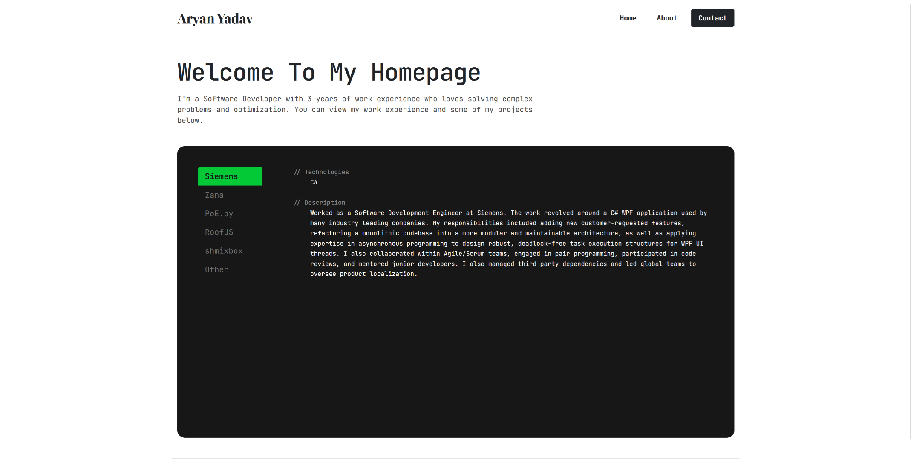

# WebDevHomepage

Personal portfolio homepage built with HTML, CSS, vanilla JavaScript, and Bootstrap 5. The site showcases professional experience, selected projects, and a contact page with client-side form validation.

**Live site:** [https://xkynn.github.io/WebDevHomepage/](https://xkynn.github.io/WebDevHomepage/)

## Preview

<p align="center">
  
</p>

<p align="center"><em>Home page — project tabs and welcome section</em></p>

## Table of Contents

- [Author](#author)
- [Class Link](#class-link)
- [Project Objective](#project-objective)
- [Tech Stack](#tech-stack)
- [Project Structure](#project-structure)
- [Instructions to Build](#instructions-to-build)
- [License](#license)

## Author

**Aryan Yadav**

## Class Link

**Web Development — Summer 2026**

[Course page](https://johnguerra.co/lectures/webDevelopment_summer2026/)

## Project Objective

Build a responsive, multi-page personal homepage that demonstrates core front-end skills:

- **Layout & styling** — Semantic HTML, custom CSS, and Bootstrap 5 for a consistent, mobile-friendly UI across Home, About, and Contact pages.
- **Dynamic content** — Fetch and display public GitHub repositories on the Home page “Other” tab via the GitHub REST API.
- **Client-side interactivity** — Contact form validation, mailto submission, Discord ID copy-to-clipboard, and toast feedback without a backend server.
- **Code quality** — ESLint and Prettier enforce consistent JavaScript style across `js/` files.

## Tech Stack

| Layer | Technologies |
| --- | --- |
| Markup | HTML5 |
| Styling | CSS3, Bootstrap 5, Google Fonts |
| Scripting | Vanilla JavaScript (ES modules) |
| Tooling | ESLint, Prettier, Node.js (dev only) |
| Deployment | GitHub Pages, Vercel (static hosting) |
| Documentation & Contact Page | Cursor Auto Agent Router |

## Project Structure

```text
WebDevHomepage/
├── index.html              # Home — projects & experience tabs
├── about.html              # About page
├── contact.html            # Contact form & info
├── js/
│   ├── projects.js         # GitHub API integration
│   └── contact.js          # Form validation & copy actions
├── style/
│   └── style.css           # Custom styles
├── res/
│   └── screenshot-homepage.png
├── eslint.config.js        # ESLint + Prettier rules
├── package.json
└── README.md
```

## Instructions to Build

This is a **static site** — there is no compile or bundle step. Building means installing dev tools (optional), running the site locally, and linting JavaScript before deploy.

### Prerequisites

- [Node.js](https://nodejs.org/) (v18+ recommended) — for ESLint only
- A modern web browser
- A local static file server (recommended; required for GitHub API fetch in some environments)

### 1. Clone the repository

```bash
git clone https://github.com/xKynn/WebDevHomepage.git
cd WebDevHomepage
```

### 2. Install dependencies

```bash
npm install
```

### 3. Run locally

Choose one of the following:

#### Option A — `npx serve` (recommended)

```bash
npx serve .
```

Open the URL printed in the terminal (for example, `http://localhost:3000`).

#### Option B — VS Code Live Server

Open the project in VS Code, right-click `index.html`, and choose **Open with Live Server**.

#### Option C — Python built-in server

```bash
# Python 3
python -m http.server 8080
```

Then visit `http://localhost:8080`.

> **Warning:** Avoid opening HTML files directly via `file://`. The GitHub API fetch on the Home page may be blocked by the browser in that context.

### 4. Lint JavaScript (optional)

```bash
npx eslint js/*.js
```

Auto-fix formatting issues:

```bash
npx eslint js/*.js --fix
```

### 5. Deploy

No build artifact is produced. Deploy the repository root as a static site:

| Platform | Steps |
| --- | --- |
| **GitHub Pages** | Enable Pages for the `main` branch. Project repos are served at `/WebDevHomepage/`. |
| **Vercel** | Import the repo and deploy with default static settings (no build command, output directory `.`). |

After deploying, hard-refresh the browser if scripts or styles do not update immediately.

## License

This project is licensed under the [MIT License](LICENSE).
